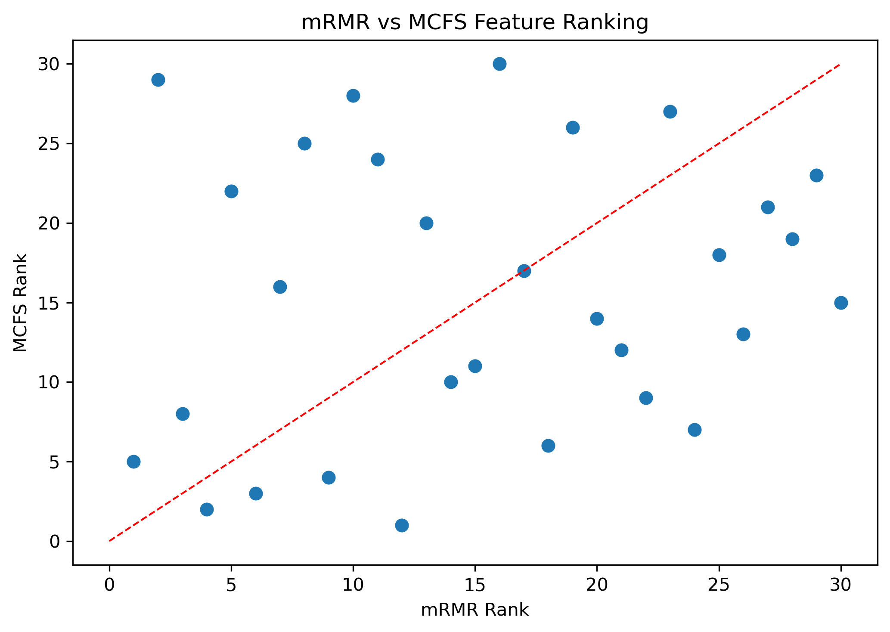
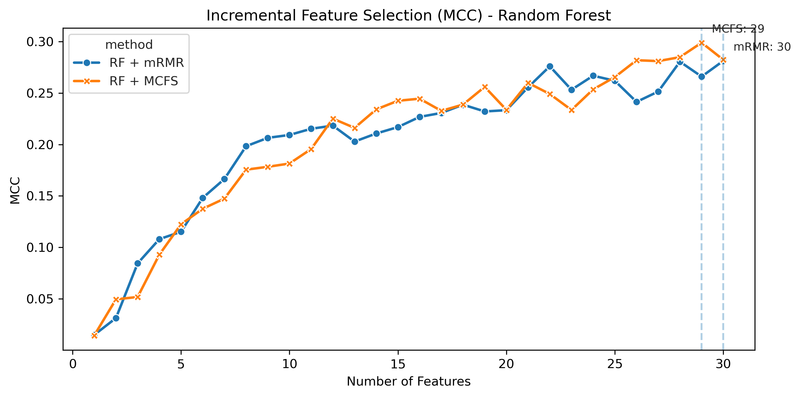
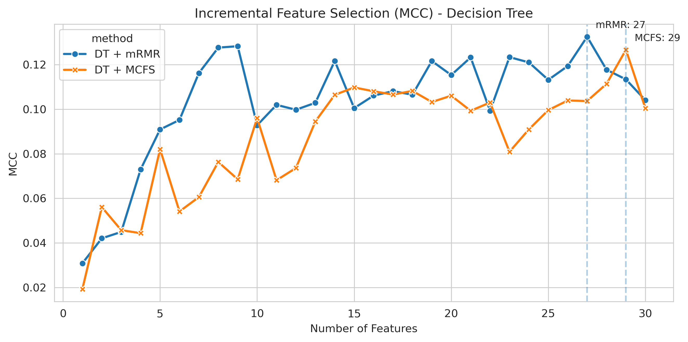
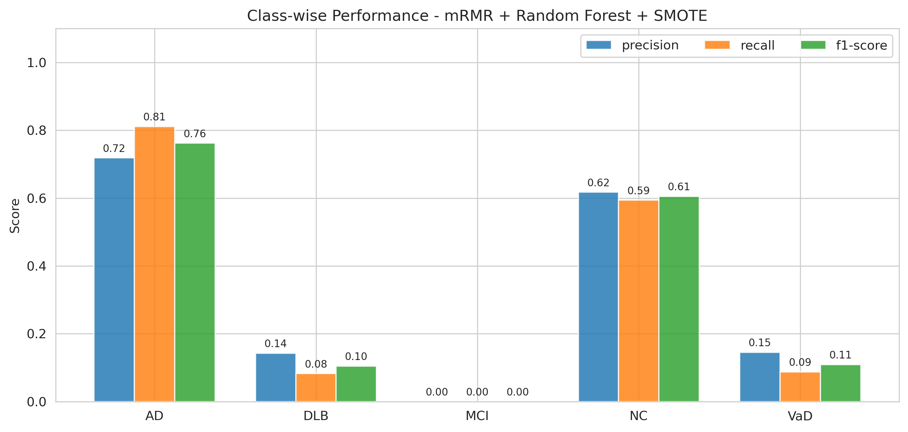
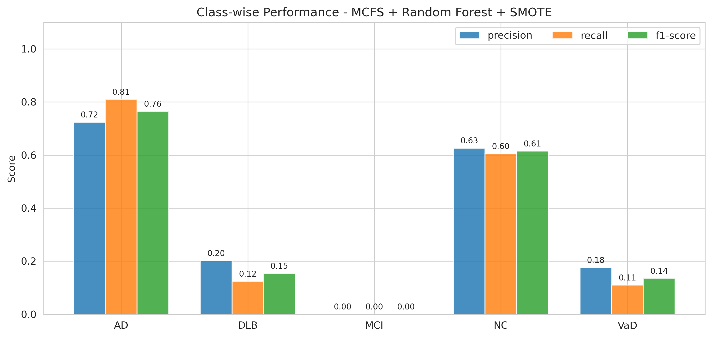
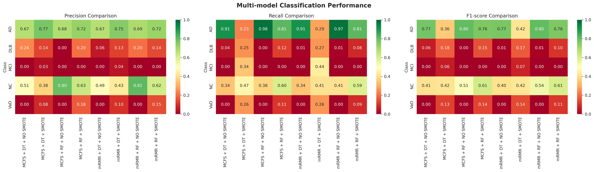
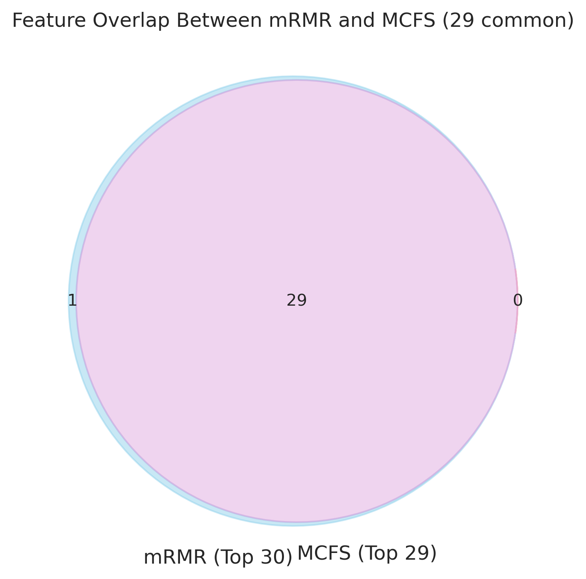
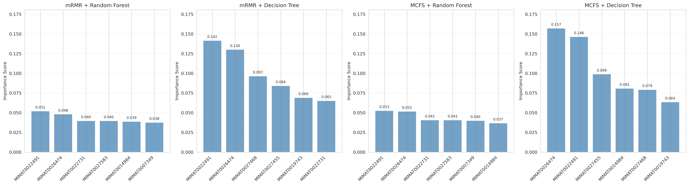

# MicroRNA Signatures for Neurodegenerative Diseases

 
 
This repository contains code and analysis for identifying microRNA signatures 
associated with various neurodegenerative diseases using publicly available
 gene expression datasets. 

 

#### Acknowledgements

Most of the experiments in this repository are based on the methods described in the following research paper. While these experiments may not completely follow the original methodology, we gratefully acknowledge the detailed and reproducible description provided in their work:

> Li, Z., Guo, W., Ding, S., Chen, L., Feng, K., Huang, T. and Cai, Y.D., 2022. Identifying key MicroRNA signatures for neurodegenerative diseases with machine learning methods. Frontiers in Genetics, 13, p.880997.
 
  

 ### Dataset

The dataset used in this study is sourced from the Gene Expression Omnibus (GEO) download [GEO Accession viewer](https://www.ncbi.nlm.nih.gov/geo/query/acc.cgi?acc=GSE120584).

The dataset contains 1601 samples for various neurodegenerative diseases as shown in the table below (01B_Data_Exploration.ipynb):

| Disease Case | Sample Size |
|--------------|-------------|
| Alzheimer’s disease (AD) | 1,021 |
| Vascular dementia (VaD) | 91 |
| Dementia with lewy bodies (DLB) | 169 |
| Mild cognitive impairment (MCI) | 32 |
| Normal control (NC) | 288 |

### Exploratory Data Analysis

Data Information:
 
- **GEO Accession**: GSE120584
- **Technology**: Agilent miRNA Microarray
- **Samples**: 1,601 human serum samples
- **Disease Classes**: AD, VaD, DLB, MCI, and Normal Control
 
After data prefrocessing we obtained a final expression matrix shape: (2547, 1601)
- miRNAs: 2547 features
- Samples: 1601 observations
- Missing Values: 0 (complete data)

*Details on data preprocessing in : 01_DataExploration/README.md*

### Feature Ranking
We use BorutaPy package to filter the features. **30 out of 2547** featrues were selected using boruta filtering using RandomForest as an estimator. For all parameters of boruta, default values were used.

 

#### Minimum Redundancy Maximum Relevance (mRMR)

  To rank features by maximum relevance and minimum redundancy we applied mRMR feature ranking. Which uses F-test for relevance measurement, Pearson correlation for redundancy and returns features ordered by importance.

#### Monte Carlo Feature Selection Feature Ranking (MCFC)

Then we tried to rank the features using Monte Carlo ensemble approach.

When comparing mRMR vs MCFS, there was not much agreement betwee two methods as shown in the scatterplot.

  
## Incremental Feature Selection and Classification

After feature ranking was analyed, we conducted Incremental Feature Selection (IFS). We used RandomForest and Decision Trees (Although, the paper[1] used PART from Weka, we tried to use closest interpretable model available in SKLearn Package) as our classifiers and identicied the best set of features based on MCC as evaluation metric.

 

**TABLE**  Classification Performance of Random Forest and Decision Tree Models with mRMR and MCFS Feature Selection Methods
| Model | Accuracy | F1-score (weighted) | MCC |
|:------|---------:|-------------------:|----:|
| mRMR + RF + SMOTE | 0.9328 | 0.9311 | 0.9169 |
| mRMR + DT + SMOTE | 0.5350 | 0.5172 | 0.4289 |
| MCFS + RF + SMOTE | 0.9369 | 0.9356 | 0.9218 |
| MCFS + DT + SMOTE | 0.5120 | 0.4954 | 0.3995 |
| mRMR + RF + (NO SMOTE) | 0.6933 | 0.6098 | 0.3222 |
| mRMR + DT + (NO SMOTE) | 0.6415 | 0.5647 | 0.1850 |
| MCFS + RF + (NO SMOTE) | 0.6896 | 0.6032 | 0.3113 |
| MCFS + DT + (NO SMOTE) | 0.6421 | 0.5670 | 0.1945 |

From classification results, we can see that:
- Models with SMOTE consistently perform better than those without SMOTE
- Random Forest models performed better than Decision Tree models
- MCFS + RF + SMOTE achieves the highest performance across all metrics

##### Classwise Performance for mRMR features using RandomForest

##### Classwise Performance for MCFS features using RandomForest

##### Comparison of Precision, Recall and F1-score of different models

##### Overlap in features selected by mRMR method and MCFS methods

Venn diagram to show overlap between the top miRNA features selected by mRMR method and MCFS method
- 25 miRNA features are commonly identified.

##### Feature Importance

Feature importance ranking of the miRNA features selected using mRMR and MCFS methods as obtained from Random Forest and Decision Trees.

### File information:

 Repository consists of following notebooks:
 1. **01A_Understanding_Raw_Data.ipynb** : Understanding raw data
 2. **01B_Data_Exploration.ipynb** : series matrix data exploration
 3. **02A_BorutaFeatureRanking.ipynb**: feature filtering using`BorutaPy`
 4. **02B_FeatureRanking.ipynb**: mRMR  and MCFC based feature ranking
 5. **03A_IncrementalFeatureSelection.ipynb**: incremental feature selection and classification
 6. **04A_ClassificationResults.ipynb**: Classification using RF and Decision Trees

### Install Requirements

Requirements for this project are available in `requirements.txt`

 ## References
 [1] Li, Z., Guo, W., Ding, S., Chen, L., Feng, K., Huang, T. and Cai, Y.D., 2022. Identifying key MicroRNA signatures for neurodegenerative diseases with machine learning methods. Frontiers in Genetics, 13, p.880997.

 [2] Kursa M., Rudnicki W., "Feature Selection with the Boruta Package" Journal of Statistical Software, Vol. 36, Issue 11, Sep 2010